# Elastic Stack SOC Analyst Project

This is a self-directed cloud SOC project I've been building on Vultr. The goal was to set up a real detection environment from the ground up: deploy the Elastic Stack, centralize endpoint and authentication logs through Fleet and Elastic Agent, and build actual detection rules and dashboards on top of it.

Two of the servers in this environment are internet-facing, so this isn't running on simulated data. I'm capturing real attack traffic, including thousands of brute-force login attempts against SSH and RDP from sources all over the world.

## Table of Contents

- [Architecture Overview](#architecture-overview)
- [1. Elastic Stack Provisioning](#1-elastic-stack-provisioning)
- [2. Kibana Setup and HTTP/HTTPS Troubleshooting](#2-kibana-setup-and-httphttps-troubleshooting)
- [3. Windows Server Deployment](#3-windows-server-deployment)
- [4. Fleet Server and Elastic Agent Enrollment](#4-fleet-server-and-elastic-agent-enrollment)
- [5. Sysmon Installation and Configuration](#5-sysmon-installation-and-configuration)
- [6. Ingesting Sysmon and Defender Logs into Elasticsearch](#6-ingesting-sysmon-and-defender-logs-into-elasticsearch)
- [7. Internet-Facing Ubuntu Server: Confirmed Active SSH Target](#7-internet-facing-ubuntu-server-confirmed-active-ssh-target)
- [8. Elastic Agent and Auth Log Ingestion on the Ubuntu Server](#8-elastic-agent-and-auth-log-ingestion-on-the-ubuntu-server)
- [9. SSH Brute-Force Detection: Query, Alert, and Geo Dashboard](#9-ssh-brute-force-detection-query-alert-and-geo-dashboard)
- [10. Detection Rules: SSH and RDP Brute Force](#10-detection-rules-ssh-and-rdp-brute-force)
- [11. RDP Authentication Dashboard](#11-rdp-authentication-dashboard)
- [Key Lessons Learned](#key-lessons-learned)
- [Next Steps](#next-steps)

---

## Architecture Overview

| Component | Role | Exposure |
|---|---|---|
| Elastic Server (Ubuntu 22.04, 4 vCPU / 16GB RAM) | Elasticsearch + Kibana | Internal, IP restricted |
| Fleet Server (Ubuntu) | Centralized Elastic Agent management | Internal, IP restricted |
| Windows Server (Windows 2022, 1 vCPU / 2GB RAM) | RDP target, outside the VPC | Internet facing (RDP exposed intentionally) |
| Ubuntu Server (24.04, 1 vCPU / 1GB RAM) | SSH target | Internet facing (SSH exposed intentionally) |

I deliberately placed the Windows and Ubuntu target servers outside the private VPC and left them internet facing. That wasn't an oversight. It's what makes the detection rules and dashboards below actually mean something: they're triggering on real attacker traffic, not test data I made up myself.

---

## 1. Elastic Stack Provisioning

Signed up for Vultr, created a Virtual Private Cloud (VPC), and deployed a dedicated Ubuntu server to host Elasticsearch and Kibana.

**Elastic server specs:** Ubuntu 22.04 x64, 4 vCPUs, 16,384 MB RAM, 80 GB NVMe, Toronto region.

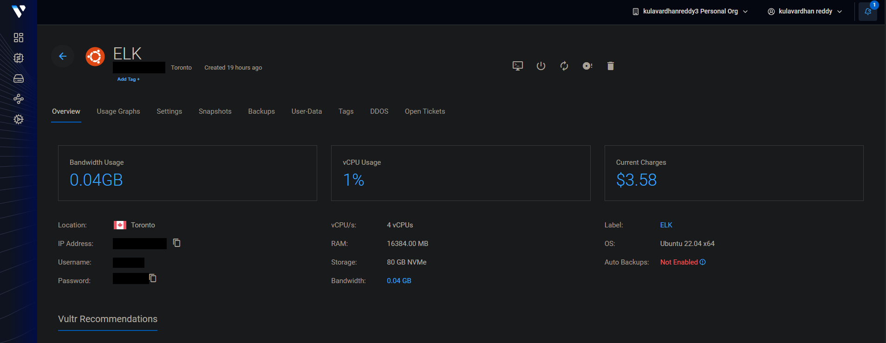

Installed Elasticsearch and updated `elasticsearch.yml` so it would accept connections beyond localhost, since Kibana and the Fleet-managed agents both needed to reach it.

---

## 2. Kibana Setup and HTTP/HTTPS Troubleshooting

Installed Kibana on the same server and configured `kibana.yml` with `server.port: 5601` and `server.host` set to the instance's IP. Opened port 5601 in two places: the Vultr cloud firewall (restricted to my own IP) and UFW on the VM itself.

### The troubleshooting story

Even with everything configured correctly, Kibana was unreachable from my machine. I worked through it step by step.

First I confirmed Kibana was actually listening on the server:
```bash
sudo ss -tulpn | grep 5601
```
It was bound to the public IP on port 5601, not 127.0.0.1, so that ruled out a Kibana binding issue.

Then I checked UFW:
```bash
sudo ufw status
```
Port 5601 was allowed for both tcp and tcp v6.

Then I tested from the server itself with curl and got a 200 OK, meaning Kibana was healthy. I ran the same curl command from my own machine and also got 200 OK. So the network path, the firewall, and UFW were all fine.

The actual problem turned out to be my browser. Chrome and Edge were auto upgrading the request from http:// to https:// because of a setting called "Always use secure connections." Kibana was only serving plain HTTP, since I hadn't configured any TLS certificate. When the browser tried a TLS handshake against a plain HTTP listener, the two sides couldn't agree on a protocol, which just showed up as a vague connection error instead of anything that pointed at the real cause.

Typing the address as http:// explicitly fixed it right away.

What I took away from this: if curl works from your own machine but the browser still fails, the problem is probably something the browser is doing, not the network. Also worth knowing that Kibana defaults to plain HTTP unless you turn TLS on yourself, which is an easy thing to get bitten by now that browsers assume HTTPS by default.

---

## 3. Windows Server Deployment

Deployed a Windows target server and kept it outside the VPC on purpose, for network segmentation. If this box ever got compromised or hammered by scanners, I didn't want it able to pivot into the internal Elastic Stack network.

**Specs:** Windows 2022 Standard, 1 vCPU, 2048 MB RAM, 55 GB SSD, Toronto region. I exposed RDP to the internet on purpose (not restricted to my IP) so I could observe real login activity in the logs.

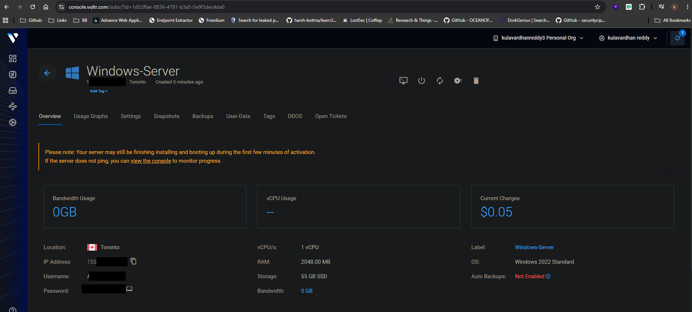

---

## 4. Fleet Server and Elastic Agent Enrollment

Deployed a separate Ubuntu server just for Fleet Server, kept apart from the Elastic server, and connected it to Elasticsearch. Opened port 8220 for Fleet enrollment traffic.

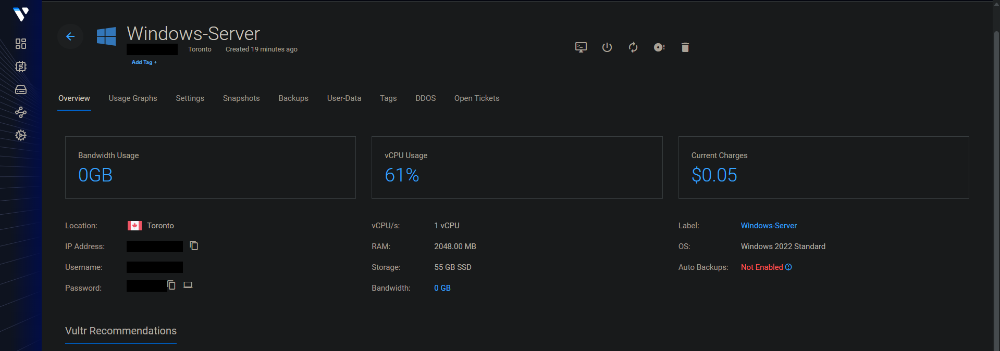

Installed Elastic Agent 9.5.0 on the Windows Server through an elevated PowerShell session, using the `--insecure` flag to get past the self-signed certificate during enrollment. That's a shortcut I'm fine taking in a personal lab, but not something I'd carry into a production environment.

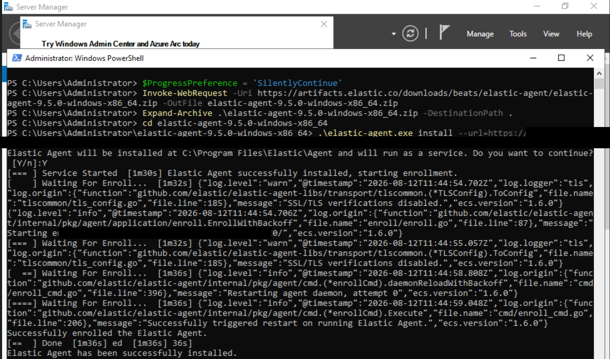

It enrolled successfully on the first try, confirmed by the PowerShell output: "Successfully enrolled the Elastic Agent."

---

## 5. Sysmon Installation and Configuration

Downloaded and installed Sysmon (v15.21) on the Windows Server using Olaf van der Voort's community Sysmon config, a well known configuration that balances good event coverage against log noise. I used this instead of writing my own config from scratch.

```powershell
.\Sysmon64.exe -i sysmonconfig-export.xml
```

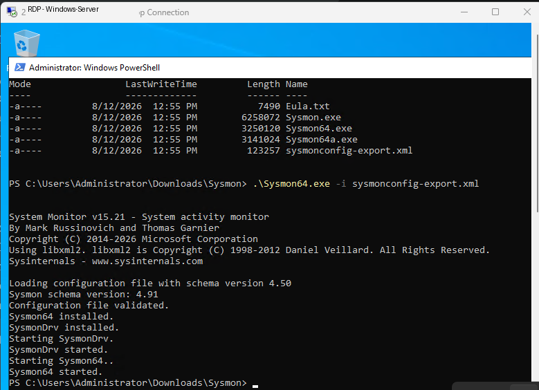

Checked Windows Event Viewer afterward and confirmed Sysmon was actively logging under Sysmon > Operational, including Event ID 1 (Process Create) events.

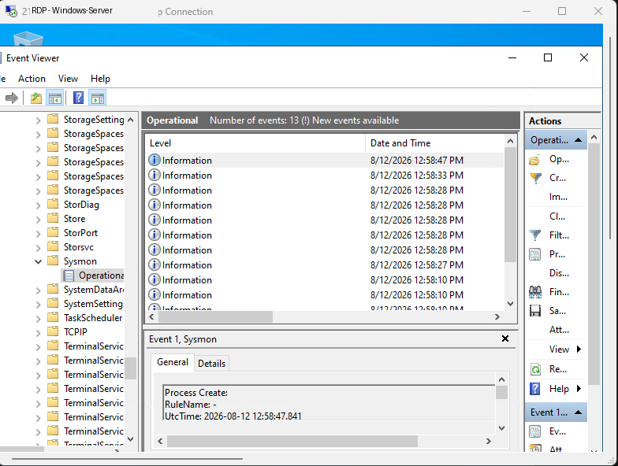

---

## 6. Ingesting Sysmon and Defender Logs into Elasticsearch

Added a custom Windows Event Log integration in Fleet, linking both the Sysmon operational channel and the Microsoft Defender operational channel to the Windows Server's agent policy. I ingested all events from both channels without filtering by event ID at this stage.

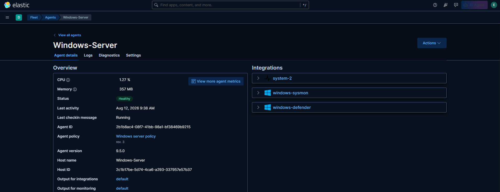

### Troubleshooting: agent connectivity failure

Right after adding the integration, the Windows agent stopped reporting. CPU and memory showed N/A in the Fleet agent view. I traced it back to port 9200 (Elasticsearch's REST API port) being closed. That's the port Elastic Agent uses to actually ship data to Elasticsearch, so with it closed the agent had no way to report in, which is why the metrics went blank.

I opened port 9200 and the agent came back to a Healthy status with live metrics again.

One thing worth calling out: while I was troubleshooting I had opened port 9200 to any source (0.0.0.0). Once I confirmed logs were flowing, I went back and tightened the firewall rule to only allow the Windows Server's IP. Leaving Elasticsearch's API open to the whole internet is a known and commonly exploited mistake, so I wanted to fix that properly rather than leave it open just because it was working.

I confirmed ingestion was working in Kibana Discover, seeing live Sysmon events with `event.provider: Microsoft-Windows-Sysmon` flowing in, with 32 matching documents for `winlog.event_id:1` in the sample window shown below.

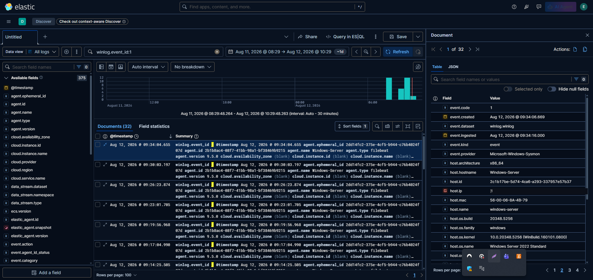

---

## 7. Internet-Facing Ubuntu Server: Confirmed Active SSH Target

Deployed a second, lightweight Ubuntu server (24.04, 1 vCPU / 1GB RAM) on Vultr and left it internet facing, with the goal of capturing real SSH authentication activity.

I later confirmed this was actually working as intended. Section 9 below shows almost 3,000 failed login attempts captured within about 24 hours of the box being exposed.

---

## 8. Elastic Agent and Auth Log Ingestion on the Ubuntu Server

Installed and enrolled Elastic Agent on the Ubuntu server. Confirmed it was healthy and actively shipping data through Fleet.

Configured the System integration with "System auth logs" enabled, pointing at both `/var/log/auth.log*` (the Debian/Ubuntu path) and `/var/log/secure*` (the RHEL/CentOS path), so it would work regardless of distro.

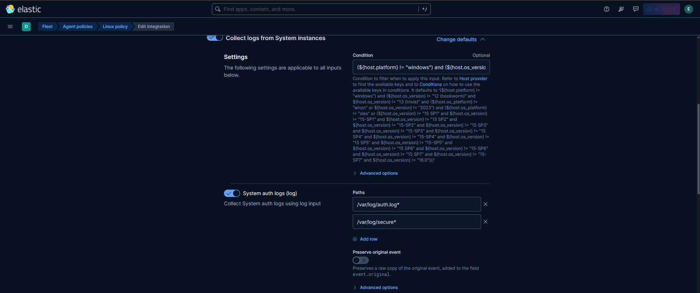

---

## 9. SSH Brute-Force Detection: Query, Alert, and Geo Dashboard

Built a Discover query to isolate failed SSH logins:

```
system.auth.ssh.event: Failed
```

This surfaced `user.name` and `source.ip` for every failed attempt. In about a 24 hour window, I captured 2,996 failed login events, targeting common usernames like root, docker, webadmin, and others. Classic brute-force / credential stuffing behavior.

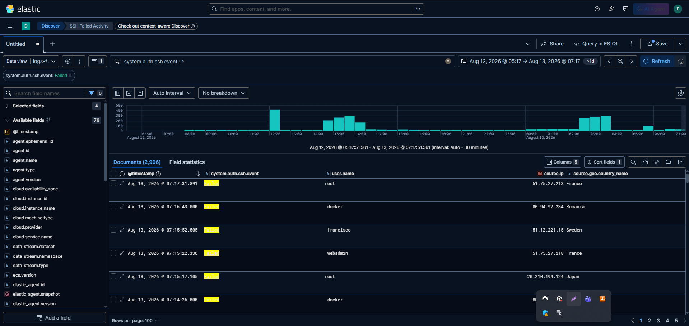

Created a threshold alert rule that triggers on repeated failed SSH attempts within a set time window, so I'd get near real-time notice of brute-force activity instead of having to go looking for it.

Built a geospatial dashboard in Elastic Maps with two panels, SSH Failed Authentication and SSH Successful Authentication, mapping attacker source countries using `source.geo.country_iso_code`. The failed authentication panel showed heavy activity from the United States (3,218 attempts) along with clusters across Europe, plus activity from Turkey, Sweden, and Japan.

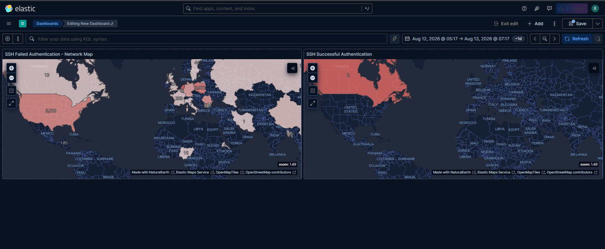

---

## 10. Detection Rules: SSH and RDP Brute Force

Built two threshold-based detection rules using Kibana's Security app instead of the simpler Discover threshold alerts, since the Security app gives you grouping by field, custom risk scoring, and highlighted context fields.

### SSH Bruteforce Attempt

- Detects failed authentication toward root on the Ubuntu server
- Query: `system.auth.ssh.event:* and agent.name:"Linux" and system.auth.ssh.event:"Failed" and user.name:"root"`
- Grouped by `source.ip` and `user.name`, threshold of 5 or more
- Severity: Medium (risk score 47)

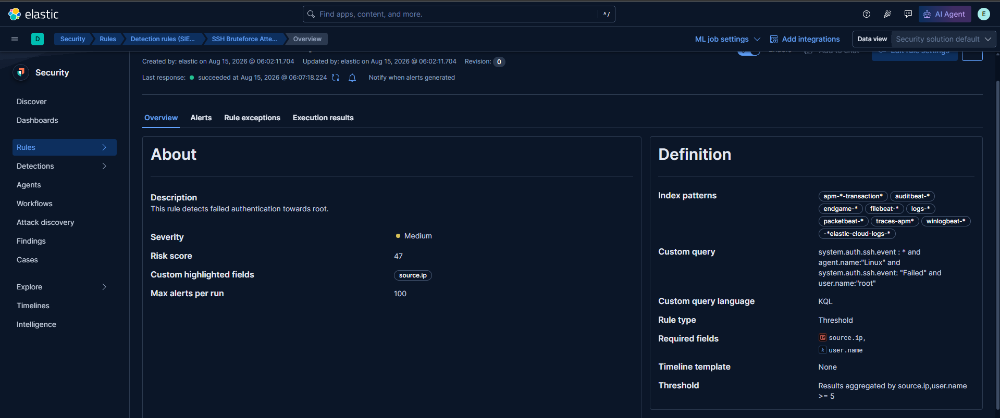

### RDP Bruteforce Attempt

- Detects failed authentication toward Administrator via RDP on the Windows Server
- Query: `event.code:"4625" and agent.name:"Windows-Server" and user.name:"Administrator"`
- Grouped by `source.ip` and `user.name`, threshold of 5 or more
- Severity: Medium (risk score 47)

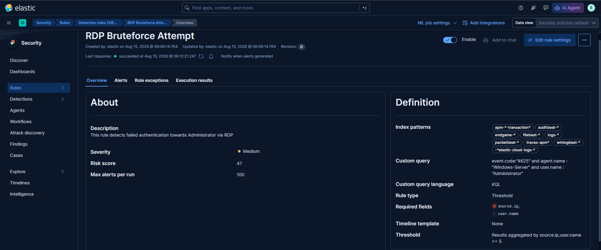

Both rules are running successfully, confirmed by the "succeeded" status shown in each rule's execution history.

---

## 11. RDP Authentication Dashboard

Built two more Elastic Maps visualizations for the Windows Server and added them to the same dashboard as the SSH maps from Section 9.

- RDP Successful: `event.code:"4624" and (winlog.event_data.LogonType:10 or winlog.event_data.LogonType:7)`, since event code 4624 alone covers several different logon types and I wanted only the RDP/interactive ones
- RDP Failed: `event.code:"4625"`

Both mapped on a Choropleth world map using `source.geo.country_iso_code`, over a 7 day window.

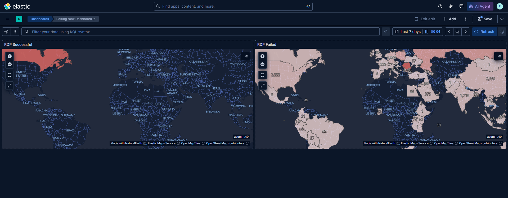

The RDP Failed panel showed real, heavy attacker volume: thousands of failed attempts concentrated in the United States (roughly 3,398 to 3,465) and significant activity across Europe and Asia, with Turkey alone showing around 1,713 attempts. The Windows Server is clearly under the same kind of continuous brute-force pressure as the Ubuntu box.

---

## Key Lessons Learned

- Port access needs to be opened at every layer along the path: the cloud firewall, the host firewall (UFW), and the application's own bind config. Miss any one of those and it just looks like "can't connect" with no obvious reason why.
- If curl works from your own machine but the browser still fails, that's usually a browser problem, not a network one. Worth checking before you go back and start second guessing your firewall rules.
- Kibana serves plain HTTP by default unless you turn TLS on yourself, which is easy to forget now that browsers assume HTTPS everywhere.
- Firewall rules opened up for troubleshooting should get tightened back down once the issue is fixed. The port 9200 exposure was a real gap, even if brief, and I wanted to actually go back and correct it instead of leaving it open since it "worked."
- Network segmentation still matters in a personal lab. Keeping the Elastic Stack and Fleet inside the VPC while only the intended targets (Windows and Ubuntu) sat exposed limited how much damage either of those two boxes could actually do if something went wrong.
- Real attacker data is more useful than data I'd make up myself for testing detection logic. The brute-force alerts and dashboards here are validated against genuine attack traffic, not staged events.

---

## Next Steps

- [ ] Bring another Linux endpoint online with Sysmon-equivalent monitoring
- [ ] Expand detection coverage past brute-force, toward things like privilege escalation or lateral movement indicators
- [ ] Look into adversary simulation with a C2 framework to validate detections end to end
- [ ] Write up incident response runbooks based on the alerts already in place
